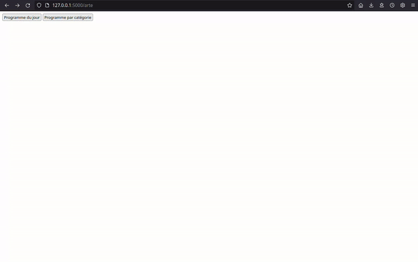

<!-- Logo Section  -->
<div align="center">
    <a href="https://www.arte.tv/fr/direct/" target="_blank">
        
    </a>
</div>

<!-- Project title -->
<div align="center">
    <a href="https://git.io/typing-svg"></a>
</div>

<!-- Shields -->
<div align="center">
    <a href="https://github.com/alexispages/Ultimate-ARTE-web-app/blob/main/LICENSE"></a>
    <a href="https://github.com/alexispages/Ultimate-ARTE-web-app/actions/workflows/python-unittest.yml"></a>
    <a href="https://github.com/alexispages/Ultimate-ARTE-web-app/actions/workflows/docker-features.yml"></a>
    <a href="https://github.com/alexispages/Ultimate-ARTE-web-app/releases"></a>
</div>

## About
UAWA is a Python web app to retrieve the list of programs from the best channel in the world and filter them by category.

## Getting started

Our Docker image is available on [Docker Hub](https://hub.docker.com/r/plag3/uawa). We use **2 tags** to distribute this image:
- **beta** : contains the latest features of the main branch
- **vX.X.X** : corresponds to a major release of our web app
<br/>

- Make sure you have [Docker installed on your system](https://docs.docker.com/get-docker/)
- Pull then run the container locally
```bash
$ docker pull plag3/uawa
$ docker run --rm --name uawa -d -p 5000:5000 plag3/uawa:v1.0.0
```
- Access the webapp on http://localhost:5000/arte

<p align="right"><a href="#about">back to top ⬆️</a></p>

### Build docker image locally
- Clone this repository into your local machine
```bash
$ git clone https://github.com/alexispages/Ultimate-ARTE-web-app.git
$ cd Ultimate-ARTE-web-app/
```
- Make sure you have [Docker installed on your system](https://docs.docker.com/get-docker/)
- Build then run the container locally
```bash
$ docker build -t plag3/uawa:v1.0.0 .
$ docker run --rm --name uawa -d -p 5000:5000 plag3/uawa:v1.0.0
```
- Access the webapp on http://localhost:5000/arte

### Run python app locally
- Clone this repository into your local machine
```bash
$ git clone https://github.com/alexispages/Ultimate-ARTE-web-app.git
$ cd Ultimate-ARTE-web-app/
```
- Make sure you have a working installation of [Python](https://docs.python.org/3/using/index.html) and [Pip](https://pip.pypa.io/en/stable/getting-started/) on your system

- Run the app in a [virtual environment](https://docs.python.org/3/tutorial/venv.html)
```bash
$ python3 -m venv $my_venv
$ pip3 install -r requirements.txt
$ python3 app.py
```
- Access the webapp on http://localhost:5000/arte

<p align="right"><a href="#about">back to top ⬆️</a></p>

## Demo

<div align="center">
    
</div>

## Features
Thanks to ARTE's API, you will find on our webapp :
- The page */arte/programme_du_jour* containing all the **programs of the day**, their **starting time** and their **thumbnail**.
- The second page */arte/categories* with a drop-down menu allowing you to **list** the **day's programs according to the category they are associated with**.

<p align="right"><a href="#about">back to top ⬆️</a></p>

## Contributors

<a href="https://www.linkedin.com/in/alexis-pag%C3%A8s"></a>

<a href="https://www.linkedin.com/in/anatole-wilke-0819051a8/"></a>

## Acknowledgments
- [README Template](https://github.com/YousefIbrahimismail/Project-README-Template)
- [ARTE API](https://api.arte.tv/api/player/v2/playlist/fr/LIVE?)
- [Flask](https://flask.palletsprojects.com/en/2.2.x/)
- [Docker](https://docs.docker.com/language/python/build-images/)
- [GitHub Actions](https://docs.github.com/en/actions)
- [Unittest Framework](https://docs.python.org/3/library/unittest.html)
- [Beautiful Soup](https://www.crummy.com/software/BeautifulSoup/bs4/doc/)
- [jsonpath-rw-ext](https://python-jsonpath-rw-ext.readthedocs.io/en/latest/)

## License
- [MIT License](./LICENSE)

<p align="right"><a href="#about">back to top ⬆️</a></p>
